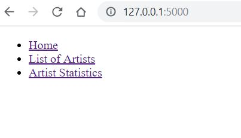
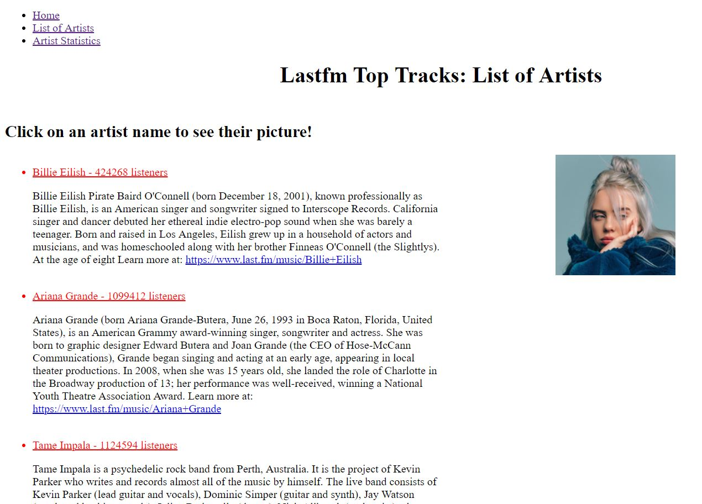

## Project Description
This is a Flask application that shows details about the top 50 music tracks on the music platform Last.fm. The home shows details about each of the tracks. There is a route to look at the list of all the artists that have songs in the Last.fm top 50 tracks list. Another route shows bar charts of the number of listeners and play count each of these artists have on Last.fm. Users can click on each artist’s name on the artist details route to see their picture. Users can also click on a navigation bar to navigate through the different routes.

## How to run
1.  First, you should install requirement with `pip install -r requirements.txt`.
2.  Second, you should run the `SI507project_tools.py` file to create the necessary files for the Flask application to run.
3.  To run the Flask application, type `python SI507project_app.py runserver` in the command prompt.
4. The application will begin running, open up a tab in a web-browser and type the following in the URL bar: `127.0.0.1:5000`. This will take you to the home page of the route with a list of the top 50 artists on Last.fm.

## How to use
1.  Click on the links on the top left to navigate through the different routes of the application.

2.  On the `List of Artists` page, click on an artist's name to see their image on the left.

## Routes in this application
-  `/` -> this is the home page, it shows details about the top 50 tracks on the music platform Last.fm
-  `/all_artists` -> this route lists the details of all the artists that have songs on the Last.fm top 50 tracks list. Users can click on an artists name to see their image.
-  `/artist_statistics` -> this route displays bar graphs showing the count of listeners and play counts these artists have on Last.fm.

## How to run tests

1.  Run the `SI507project_tests.py` file.

## In this repository:

* screenshots (Directory)
    * artist_details.JPG
    * navigation.JPG
*  static (Directory)
    * artist_info.js
*  templates (Directory)
    * all_artists.html
    * chart.html
    * index.html
* README.md
* SI507project_app.py
* SI507project_tests.py
* SI507project_tools.py
* database_model.JPG
* requirement.txt
* sample_tracks.db
